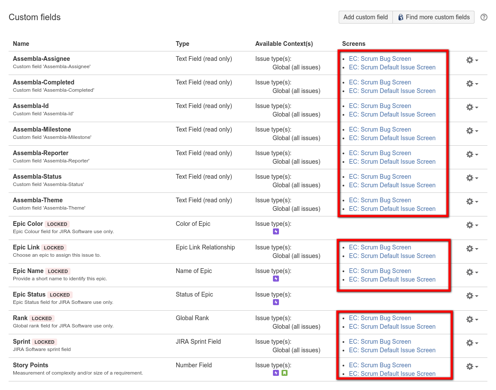
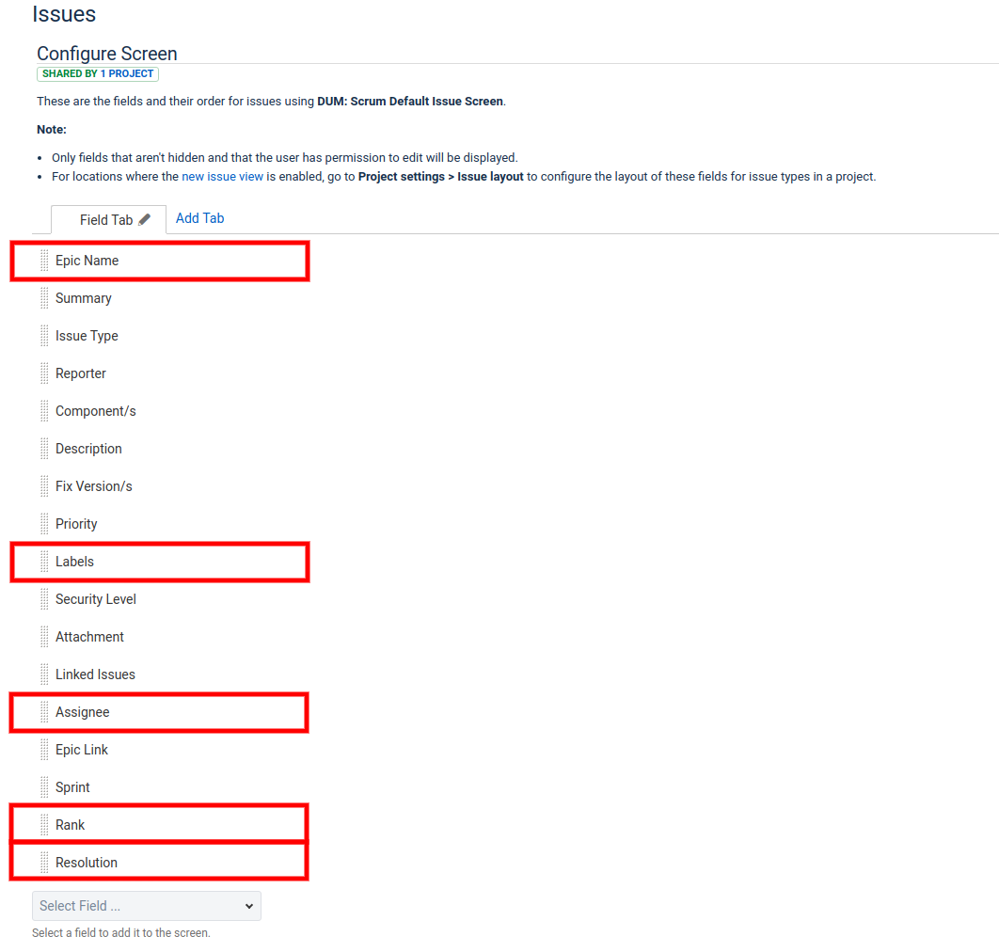
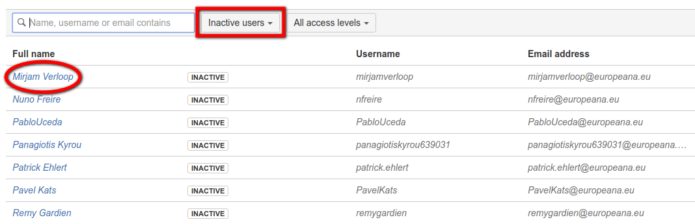
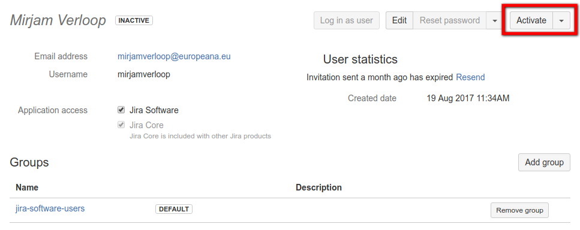
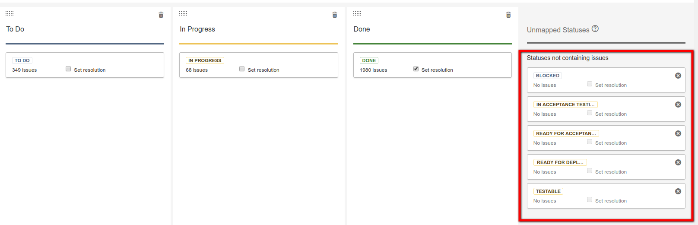

# Assembla-to-Jira

A collection of advanced tooling which provides seamless data migration from [Assembla](https://www.assembla.com) to [Jira](https://www.atlassian.com/software/jira).


This is by far the best migration toolset around. Here are just a few of the many reasons why this version beats out all the others hands down:

* Fully automated with minimal manual actions
* Configuration file with various options
* Import users (names, emails, roles and permissions)
* Import tickets, comments, attachments and relationships
* Retain ticket status, labels and ranking
* Link back to original Assembla tickets for reference
* Save relevant Assembla context in user-defined fields
* Insert embedded image thumbnails in descriptions and comments
* Convert markdown and urls
* Retain watchers of tickets
* Create scrum or kanban board with workflow
* Map Assembla milestones to Jira sprints
* Populate the backlog, future and current sprints
* Resolve cross linking between external projects
* Take into account the API differences between hosted and cloud

## Introduction

Have you ever wanted to use Jira instead of Assembla, but were afraid that the switch to Jira was too risky? Are you worried that business-critical data in Assembla will get corrupted during the transition?

Jira does offer a number of standard add-ons to make certain migrations easier, but unfortunately it does not offer a tool for migrating Assembla.

However, **you are now in luck!** By using the Assembla-to-Jira migration tools, it should be very easy to export all of the relevant Assembla data and import most (if not all) of it into a Jira project without loss and/or corruption of data.

By making use of the [Assembla API](http://api-docs.assembla.cc/content/api_reference.html) and the [Jira API](https://docs.atlassian.com/jira/REST/cloud/), both environments are hooked up in order to make all necessary data transformations.

Most of the actions can be done automatically via a pipeline of scripts. Just define the required parameters in the `.env` configuration file, and you are ready to go.

Some manual actions are required since the Jira API does not support all the required data transformations, but these actions are minimal. It is very important NOT to skip these manual changes, as the successful migration depends on them.

It is best to start with a fresh installation, e.g. one in which the desired project has not yet been created. Otherwise, unexpected problems may occur. Also note that in addition to a new project, all the Assembla users are also created.

Although the documentation states that the Jira API for hosted server is nearly identical to the cloud, there are some subtle, tricky differences that can bite you when you least expect.

Don't worry, if you read all of the instructions below and do not skip anything, these annoying differences should not affect you.

## Help

If you need any help, have a look at the [support](https://github.com/kgish/assembla-to-jira#support) section below.

## Installation

The toolset has been written with the [Ruby programming language](https://www.ruby-lang.org). In order to be able to use it, you will have to have downloaded and installed the following items on your computer:

* [Ruby](https://www.ruby-lang.org/en/downloads)
* [Bundler](http://bundler.io)
* [Git](https://git-scm.com/downloads)

Once this has been done, you can checkout and install the toolset from the github repository.

```
$ git clone https://github.com/kgish/assembla-to-jira.git
$ cd assembla-to-jira
$ gem install bundler
$ bundle install
```

At this point everything should be ready to use as explained in the following sections.

## Pipeline Steps

The complete migration from start to finish consists of a series of scripts which are to be executed in order.

Like a pipeline, each script processes data and generates a dump file to store the intermediate results. This output is used in turn as input for the following script.

The reason for doing this that if something goes wrong you do not lose everything and can restart from the previous step.

Each step will generate a log of the results in the form of a csv file for reference purposes, e.g. detecting which requests failed and why. For example, importing tickets will create the `data/jira/:space/jira-tickets.csv` file where `:space` is the Assembla space name `ASSEMBLA_SPACE` in the `.env` file.

While the script is being executed, information will be logged to the console. Be sure to inspect the information, as certain instruction might be given that you must follow before continuing to the next step.

### Assembla export

First we export all the data from Assembla.

1. Space (spaces, space_tools, users, user roles, tags, milestones, ticket statuses, ticket custom fields, documents, wiki pages and tickets)
2. Tickets (comments, attachments, tags, associations)
3. Report users
4. Report tickets

### Jira import

Now that all of the Assembla data is available, we can now take this and import it into Jira.

5. Create project (and board)
6. Create issue link types
7. Get settings (issue types, priorities, resolutions, roles, statuses and projects)
8. Import users
9. Download ticket attachments
10. Import tickets
11. Resolve/update ticket links
12. Import ticket comments
13. Import ticket attachments
14. Update ticket status (resolutions)
15. Update ticket associations
16. Update ticket watchers
17. Resolve/update ticket and comment external links
18. Rank tickets (cloud only)

### Scrum/Kanban board

Using the Agile extension, create the sprints and populate the scrum/kanban board.

18. Create sprints
19. Update board

### Manual cleanup

Finally, cleanup actions need to be taken to finish things off.

20. Deactivate users not needed
21. Give admin rights to relevant users
22. Ask users to change password, check email and create avatar
23. Distribute issues into epics
24. Make backup of `data` directory for future reference

## Preparations

You will need to go to to the Jira hosted (`jira.example.org`) or cloud (`id.atlassian.net`) instance and login as admin.

Define the project in the `.env` file as `ASSEMBLA_SPACE=space-name`.

Create the following new issue types:

* Spike
* Bug (if not already present)

The issue type `spike` or `bug` will be defined for any tickets whose summary starts with `Spike: ` or `Bug: `.

Additionally, any tickets whose summary starts with `Epic :` will be defined as issue type `epic` (which is already part of the default Jira ticket types on project creation).


You will also need to configure the `issue type scheme` for the project like this:


### Environment

An example configuration file `.env.example` is provided for you to define a number environment parameters which affect the behavior.

```
# --- General settings --- #
DATA_DIR=data
TICKETS_CREATED_ON=YYYY-MM-DD
DEBUG=false

# --- Assembla settings --- #
ASSEMBLA_API_HOST=https://api.assembla.com/v1
ASSEMBLA_API_KEY=api-key
ASSEMBLA_API_SECRET=api-secret
ASSEMBLA_URL_TICKETS=https://app.assembla.com/spaces/:space-name/tickets
ASSEMBLA_SPACE=space
ASSEMBLA_SKIP_ASSOCIATIONS=parent,child,story,subtask
# Ticket types extracted from ticket summary, e.g. starting with 'Spike: '
ASSEMBLA_TYPES_IN_SUMMARY=epic,spike,bug

# --- Jira API settings --- #/
# Server type must be 'hosted' or 'cloud'
JIRA_SERVER_TYPE=cloud
# Base must start with 'https?://'
JIRA_API_BASE=https://jira.example.org
JIRA_API_HOST=rest/api/2
JIRA_API_PROJECT_NAME=Project Name
# Project type must be scrum (default) or kanban
JIRA_API_PROJECT_TYPE=scrum
JIRA_API_ADMIN_USERNAME=john.doe
JIRA_API_ADMIN_PASSWORD=secret
JIRA_API_ADMIN_EMAIL=john.doe@example.com
JIRA_API_UNKNOWN_USER=unknown.user
JIRA_API_IMAGES_THUMBNAIL=description:false,comments:true

# Cross project ticket linking
JIRA_API_SPACE_TO_PROJECT=space1-name:project1-key,space2-name:project2-name
JIRA_API_RE_TICKET=https?://.*?\.assembla\.com/spaces/(.*?)/tickets/(\d+)(?:\-[^)\]]+)?(?:\?.*\b)?
JIRA_API_RE_COMMENT=https?://.*?\.assembla\.com/spaces/(.*?)/tickets/(\d+).*?\?comment=(\d+)(?:#comment:\d+)?
JIRA_API_BROWSE_ISSUE=browse/[:jira-ticket-key]
JIRA_API_BROWSE_COMMENT=browse/[:jira-ticket-key]?focusedCommentId=:jira-comment-id&page=com.atlassian.jira.plugin.system.issuetabpanels:comment-tabpanel#comment-[:jira-comment-id]

# --- Jira Agile settings --- #
JIRA_AGILE_HOST=rest/agile/1.0
```

By using the filter `TICKETS_CREATED_ON` you can limited the tickets to those that were created on or after the date indicated. So for example:

```
TICKETS_CREATED_ON=2017-06-01
```

would only include those tickets created on or after the first of June in the year 2017.

IMPORTANT: Using this settings will result in some ticket links that cannot be resolved any more, since they were created in the past and not included in the import data.

```
$ cp .env.example .env
```

### Jira hosted versus cloud

Although the official Jira documentation claims that the hosted and cloud APIs are identical, I've found out that this isn't entirely true.

There are a couple of minor differences that must be taken into account:

* Users - The hosted version will automatically set activated to true, the cloud version will NOT.
* Ranking - The hosted version will allow you to set the issue rank while the cloud version will NOT.
* Comments - The hosted version will allow original comment authors to import comments while cloud version will NOT. 
* Attachments - The cloud version is [problematic](https://community.developer.atlassian.com/t/401-unauthorized/9540), and certain extra actions must be taken.

In the `.evv` file this is indicated by setting the `JIRA_SERVER_TYPE` configuration parameter to either `hosted` or `cloud`.

Make sure you're using your Atlassian account email address and password for basic authentication, not your Jira username.

## Export data from Assembla

You can run the export in a number of stages, output files being generated at each point in the process.

The output files are located in the directory `data/assembla/:space/` as follows:

```
$ ruby 01-assembla_export_space.rb # => space_tools.csv, users.csv, user_roles.csv tags.csv \
    milestones.csv, tickets-statuses.csv, tickets-custom-fields.csv, documents.csv, \
    wiki_pages.csv, tickets.csv
$ ruby 02-assembla_export_tickets.rb [type] # => ticket-comments.csv, ticket-attachments.csv, \
    ticket-tags.csv, ticket-associations.csv
$ ruby 03-assembla_report_users.rb # => report-users.csv
$ ruby 04-assembla_report_tickets.rb # => report-tickets.csv
```

Notice that executing `02-assembla_export_tickets.rb` can be very time consuming, so you might want to break it up into smaller chunks by passing the optional `type` (comments, attachments, tags or associations) as the first argument.

```
$ ruby 02-assembla_export_tickets.rb comments # => ticket-comments.csv
$ ruby 02-assembla_export_tickets.rb attachments # => ticket-attachments.csv
$ ruby 02-assembla_export_tickets.rb tags # => ticket-tags.csv
$ ruby 02-assembla_export_tickets.rb associations # => ticket-associations.csv
```

This allows you to recover better to the previous step in case of failure, for example near the end where you would lose all the data in the dump files.

## Import data into Jira

You can run the import in a number of stages, output files being generated at each point in the process.

### Create project (and board)

```
POST /rest/api/2/project
{
  key: project_key,
  name: project_name,
  projectTypeKey: 'software',
  description: project_description,
  projectTemplateKey: "com.pyxis.greenhopper.jira:gh-#{type}-template",
  lead: username
}
```

where `#{type}` must be either `scrum` or `kanban`.

```
$ ruby 05-jira_create_project.rb
```

Depending on the value of `JIRA_API_PROJECT_TYPE` in the `.env` file, a scrum or kanban board will be created as well with board name `{projectKey} board`.

The `projectKey` is usually just the abbreviation of the project name in all capitals. Here is an example of a project with key `ECT`:


### Custom fields

This step is very important, so do not skip it. After the project is created, you will need to define manually the following custom fields (text field read-only):

* Assembla-Id
* Assembla-Theme
* Assembla-Status
* Assembla-Milestone
* Assembla-Reporter
* Assembla-Assignee
* Assembla-Completed


and assign them to the following screens:

* Simple Issue Tracking Create Issue
* Simple Issue Tracking Edit/View Issue

Otherwise the ticket import will fail with the error message `Field 'field-name' cannot be set. It is not on the appropriate screen, or unknown`.

Additionally the following already existing custom fields need to be assigned the the same screens:

* Epic Link
* Epic Name
* Rank
* Sprint
* Story Points



On the `View Field Configuration Page` ensure the same for:

* Resolution


The same applies to the `Configure Screen Page` for the following additional (default) fields:

* Epic Name
* Rank
* Assignee
* Labels



### Create issue link types

```
POST /rest/api/2/issueLinkType
{
  name: name,
  inward: inward,
  outward: outward
}
```

Execute the followng command:

```
$ ruby 06-jira_create_issuelink_types.rb # => data/jira/:space/jira-issuelink-types.csv
```

### Get general information

Some extra general information needs gathering before the migration can start.

```
GET /rest/api/2/{issuetype|priority|resolution|role|status|project}
```

Execute the following commands:

```
$ ruby 07-jira_get_info.rb # => data/jira/:space/jira-issue-types.csv
```

which will generate the following output file in the `data/jira/:space` directory:

* jira-issue-types.csv
* jira-priorities.csv
* jira-resolutions.csv
* jira-roles.csv
* jira-statuses.csv
* jira-projects.csv

### Import users

```
POST /rest/api/2/user
{
  name: user['login'],
  password: user['login'],
  emailAddress: user['email'],
  displayName: user['name']
}
```

Read in the Assembla user file `data/assembla/:space/users.csv` and create the Jira users if they do not already exist.

```
$ ruby 08-jira_import_users.rb # => data/jira/:space/jira-users.csv
```

Make sure that all of the users have been activated by going into the admin dashboard user page. In the hosted version this should be the default, however in the cloud version you will need to change each user manually.

If this is the case, you will be given a list of those users that need to be activated.

Go to the Admin User Management:



and after clicking on the username click on the [Activate]-button:



All new user are assigned by default to the `jira-software-users` group only. So do not forget to restore the orignal Assembla admin users permissions by also assigning them to the `jira-administrators` group.

The following user:

* unknown.user@example.org

as defined in the `.env` file as `JIRA_API_UNKNOWN_USER`.

IMPORTANT: Initially the users are created with the `password` equal to their username. This is needed in order for the migration to succeed because of certain user permissions required. Do NOT change until after the migration has been completed.

### Download attachments

Before the attachments can be imported, they must first be downloaded to a local directory after which they can be imported into Jira.

This is accomplished by executing the following command:

```
$ ruby 09-jira_download_attachments.rb # => data/jira/:space/jira-attachments-download.csv
```

The downloaded attachments are placed in the `data/jira/:space/attachments` directory with the same filename, and the meta information is logged to the file `data/jira/:space/jira-attachments-download.csv` containing the following columns:

```
created_at|assembla_ticket_id|jira_ticket_id|filename|content_type
```

which is used to import the attachments into Jira in the following section. A check is made if the file already exists in order to avoid name collisions.

Note that in Jira images are treated as attachments and can be accessed that way via `[[image:IMAGE|NAME]]`.

Important: this step needs to be done before importing tickets (next section) in order that the markdown for embedded attachment (images) will work correctly.

### Import tickets

IMPORTANT: Make sure that the custom fields have been created (see above).

Alright, this is the moment we've all been waiting for. It's time to import the Assembla tickets and create the matching Jira issues.

```
POST /rest/api/2/issue
{
  create: {},
  fields: {
    project: { id: project_id },
    summary: summary,
    issuetype: { id: issue_type[:id] },
    assignee: { name: assignee_name },
    reporter: { name: reporter_name },
    priority: { name: priority_name },
    labels: labels,
    description: description,
    ...
    customfield_assembla_id: ticket_number,
    customfield_assembla_theme: theme_name,
    customfield_assembla_status: status_name,
    customfield_assembla_milestone: milestone[:name],
    customfield_rank: story_rank, # hosted only

    customfield_assembla_reporter: UNKNOWN_USER, # if reporter is missing
    customfield_assembla_assignee: '',           # if assignee cannot be assigned issues
    customfield_epic_name: EPIC_NAME,            # if issue type is epic
    parent: { id: parent_id },                   # if issue type is sub-task
    ...
  }
}
```

Now you are ready to import all of the tickets. Execute the following command:

```
$ ruby 10-jira_import_tickets.rb # => data/jira/:space/jira-tickets.csv
```

Results are saved in the output file `data/jira/:space/jira-tickets.csv` with the following columns:

```
jira_ticket_id|jira_ticket_key|project_id|summary|issue_type_id|issue_type_name|assignee_name| \
reporter_name|priority_name|status_name|labels|description|assembla_ticket_id|assembla_ticket_number| \
theme_name|milestone_name|story_rank
```

During the conversion, any differences between the original Assembla ticket description and the newly created Jira issue description is recorded in the `data/jira/:space/jira-tickets-diffs.csv` file. This is a good place to look so you can verify that indeed the markdown conversion produced the expected results.

An additional output file `data/jira/:space/jira-ticket-links.csv` is created which contains those embedded ticket links that could not be resolved. This is used in the following step.

Note: it is not possible for the original reporter (creator) of the Assembla ticket to be able to create a new issue, this is only allowed for the admin user, e.g. `headers = JIRA_HEADERS`.

### Update ticket links

In the ticket summary and description, ticket links `#123` need to be converted to the relevant Jira issue links `PRJ-456`, which can only be done AFTER all the tickets have been imported.

The output file `data/jira/:space/jira-ticket-links.csv` generated in the previous step is used as the input.

Run the following command in order to do this:

```
$ ruby 11-jira_update_ticket_links.rb
```

Note: for one reason or another, not all Assembla links point to valid tickets (deleted, moved or whatever), so these will be marked as invalid by strikethru, e.g. -#123-.

### Import comments

```
POST /rest/api/2/issue/{issueIdOrKey}/comment
{
  body: "comments go here..."
}
```

Now you are ready to import all of the comments. Execute the following command:

```
$ ruby 12-jira_import_comments.rb # => data/jira/:space/jira-comments.csv
```

Results are saved in the output file `data/jira/:space/jira-comments.csv` with the following columns:

```
jira_comment_id|jira_ticket_id|assembla_comment_id|assembla_ticket_id|user_login|body
```

During the conversion, any differences between the original Assembla ticket comments and the newly created Jira issue comments is recorded in the `data/jira/:space/jira-comments-diffs.csv` file. This is a good place to look so you can verify that indeed the markdown conversion produced the expected results.

Note: we allow the original creators of the Assembla comments to be able to create the new Jira comments, therefore retaining ownership.

### Import attachments

```
curl -D- -u admin:admin -X POST -H "X-Atlassian-Token: no-check" -F "file=@myfile.txt" \
    api/2/issue/{issueIdOrKey}/attachments
```

Now you are ready to import all of the attachments that were downloaded earlier. Execute the following command:

```
$ ruby 13-jira_import_attachments.rb [restart_offset] # => data/jira/:space/jira-attachments-import.csv
```

Note: The Jira server sometimes has problems processing attachments too quickly and might return an error. In that case, just restart the command and pass it the offset where you want to restart from.

IMORTANT: For the cloud version, the import might fail initially with a `401 Unauthorized` error. Try changing the admin login, logging out and then logging back in again. Hopefully it will now work.

I was able to get things working by defining the following headers:
```
auth = Base64.encode64(admin_email + ':' + admin_password)
headers = { 'Authorization': "Basic #{auth}", 'X-Atlassian-Token': 'no-check' }
```

See: [Atlassian Community Ticket](https://community.developer.atlassian.com/t/401-unauthorized/9540).

Another note: we allow the original creators of the Assembla attachments to be able to create the new Jira attachments, therefore retaining ownership.

### Update ticket status

Now you are ready to update the Jira tickets in line with the original Assembla state. Execute the following command:

```
$ ruby 14-jira_update_status.rb # => data/jira/:space/jira-update-status.csv
```

Important: the Jira API requests MUST be made with an Authorization Header constructed with the `reporter_name` (issue creator), otherwise a `403 Forbidden` error will be returned.

### Update ticket associations

For the default Assembla associations the relationship names are:

|  #  | Name      | Ticket2           | Ticket1       |
| --- | --------- | ----------------- | ------------- |
|  0  | Parent    | is parent of      | is child of   |
|  1  | Child     | is child of       | is parent of  |
|  2  | Related   | related to        |               |
|  3  | Duplicate | is duplication of |               |
|  4  | Sibling   | is sibling of     |               |
|  5  | Story     | is story          | is subtask of |
|  6  | Subtask   | is subtask of     | is story      |
|  7  | Dependent | depends on        |               |
|  8  | Block     | blocks            |               |

or in understandable spoken word:

```
0 - Parent (ticket2 is parent of ticket1 and ticket1 is child of ticket2)
1 - Child  (ticket2 is child of ticket1 and ticket2 is parent of ticket1)
2 - Related (ticket2 is related to ticket1)
3 - Duplicate (ticket2 is duplication of ticket1)
4 - Sibling (ticket2 is sibling of ticket1)
5 - Story (ticket2 is story and ticket1 is subtask of the story)
6 - Subtask (ticket2 is subtask of a story and ticket1 is the story)
7 - Dependent (ticket2 depends on ticket1)
8 - Block (ticket2 blocks ticket1)
```

For the default Jira issue link types we have:

| Name      | Inward           | Outward    |
| --------- | ---------------- | ---------- |
| Blocks    | is blocked by    | blocks     |
| Cloners   | is cloned by     | clones     |
| Duplicate | is duplicated by | duplicates |
| Relates   | relates to       | relates to |

```
POST /rest/api/2/issueLink
{
  type: {
    name: name
  },
  inwardIssue: {
    id: ticket1_id
  },
  outwardIssue: {
    id: ticket2_id
  }
}
```

However, since Jira already takes care of a number of issue links during issue creation (story, subtask, etc), we should disable them in the `.env` configuration file like this:

```
ASSEMBLA_SKIP_ASSOCIATIONS=parent,child,story,subtask
```

If for some reason you do not want to do this, simply comment out the line, or if you prefer to skip other Assembla association just edit the line.

Now you are ready to update the Jira tickets to reflect the original Assembla associations. Execute the following command:

```
$ ruby 15-jira_update_association.rb # => data/jira/:space/jira-update-associations.csv
```

Important: the Jira API requests MUST be made with an Authorization Header constructed with the `reporter_name` (issue creator), otherwise a `403 Forbidden` error will be returned.

### Update ticket watchers

```
POST /rest/api/2/issue/{issueIdOrKey}/watchers
'"username"'
```

Now you are ready to convert the Assembla followers list to the Jira issue watchers list. Execute the following command:

```
$ ruby 16-jira_update_watchers.rb # => data/jira/:space/jira-update-watchers.csv
```

Important: the Jira API requests MUST be made with an Authorization Header constructed with the `username` (watcher), otherwise a `403 Forbidden` error will be returned.

### External ticket/comment links

In the Assembla ticket description and comment body, we might have embedded (external) ticket links that have to be converted to the Jira format.

These tickets can only be resolved using existing dumps files (`data/jira/:space-name/jira-tickets.csv` and `data/jira/:space-name/jira-comments.csv`) from previous migrations that are indicated in the `.env` file as follows:

```
JIRA_API_SPACE_TO_PROJECT=space1-name:project1-key,space2-name:project2-key
```

Only values of `space-name` present in the `JIRA_API_SPACE_TO_PROJECT` parameter in order to be translated into the Jira equivalent.

For links that point to TICKETS, the captured format looks like:

```
BASE = https?://.*?\.assembla\.com/spaces/(:space-name)

BASE/tickets/(:ticket-number)
BASE/tickets/(:ticket-number)-.*#/activity/ticket:
BASE/tickets/(:ticket-number)/details
BASE/tickets/(:ticket-number)-.*/details
BASE/tickets/(:ticket-number)-.*/details#

REGEX = https?:\/\/.*?\.assembla\.com\/spaces\/(.*?)\/tickets\/(\d+)(?:\-.*)?(?:\?.*\b)?

$1 = space-name
$2 = ticket-number
```

For links that refer to COMMENTS, we have:

```
BASE = https?://.*?\.assembla\.com/spaces/(:space-name)

BASE/tickets/(:ticket-number)/details?comment=(:comment-id)
BASE/tickets/(:ticket-number)-.*/details?comment=(:comment-id)

REGEX = https?:\/\/.*?\.assembla\.com\/spaces\/(.*?)\/tickets\/(\d+).*?\?comment=(\d+)(?:#comment:\d+)?

$1 = space-name
$2 = ticket-number
$3 => comment-id
```

and then the links are converted like this:

```
issue => /browse/[JIRA_ISSUE_KEY]
comment => /browse/[JIRA_ISSUE_KEY]?focusedCommentId=[JIRA_COMMENT_ID]&page= \
  com.atlassian.jira.plugin.system.issuetabpanels:comment-tabpanel#comment-[JIRA_COMMENT_ID]
```

Execute the following command to update all external links:

```
$ ruby 17-jira_update_ext_links.rb => jira-links-external-all.csv
                                      jira-links-external-updated.csv
```

Two output files are generated for reference:

```
jira-links-external-all.csv     => all detected external links are listed
jira-links-external-updated.csv => only those external links actually updated
```

### External ticket/comment links

Only needed for the Jira cloud version, e.g. when `JIRA_SERVER_TYPE=cloud` in the `.env` file. Since this was not possible during the ticket creation, now is the time to rank the imported issues using the original Assembla values.

```
$ ruby 18-jira_rank_tikets.rb
```

Still not yet implemented, sorry.

## Scrum Board

You are now ready to setup the scrum board, create sprints, and assign issues to the correct sprints as well as the backlog. In the `.env` file, take notice of the following values:

```
JIRA_API_PROJECT_NAME=Project Name
JIRA_API_PROJECT_TYPE=scrum
JIRA_BOARD_NAME=name:Scrum Board Name
```

These will be used as placeholder values below.

### Create sprints

When the scrum board was created with the project, all issues are assigned to the project are automatically put in the backlog.

Now you are ready to setup the sprints by executing the following command:

```
$ ruby 19-jira_create_sprints.rb # => data/jira/:space/jira-create-sprints.csv
```

The issues are redistributed to the sprints they belong to and the most recent sprint is set as the `active` sprint.

### Update board

The final step after the board and sprints have been created is to copy the Assembla cardwall columns (ticket statuses) to the Jira board and to order the issues by rank as they were in Assembla.

In order to achieve this, execute the following command:

```
$ ruby 20-jira_update_board.rb
```

```
GET /rest/agile/1.0/board/{boardId}/configuration
```

At the time of this writing, the Jira API does not yet support creating new columns. Therefore, when the command above is executed you will see some output:

```
Board columns needed: 7
* New => To Do
* In progress => In Progress
* Testable => Testable
* Ready for acceptance => Ready for Acceptance
* In acceptance testing => In Acceptance Testing
* Ready for deploy => Ready for Deploy

Board columns actual: 3
* To Do
* In Progress
* Done
```

Followed by instructions on which columns need to be added manaully with a link showing where this can be done:

```
Go to Configure 'BOARD_NAME | Column Management' and add the following columns:
* Testable
* Ready for Acceptance
* In Acceptance Testing
* Ready for Deploy

link: JIRA_API_BASE/secure/RapidView.jspa?rapidView=3&tab=columns
```



### Create statuses

```
JIRA_API_STATUSES=New:To Do,In Progress,Blocked,Testable,Ready for Acceptance, \
    In Acceptance Testing,Ready for Deploy,Done,Invalid:Done
```


### Create workflow


## Ticket field conversions

Most of the ticket fields are converted from Assembla to Jira via a one-to-one mapping and are indicated as **bold** below.

### Assembla ticket fields:
* id
* **number**
* **summary**
* **description**
* **priority** (1 - Highest, 2 - High, 3 - Medium, 4 - Low, 5 - Lowest)
* **completed_date**
* component_id (deprecated)
* **created_on**
* permission_type
* **importance** (Sorting criteria for Assembla Planner) => 10104 Rank
* is_story (true or false, if true hierarchy_type = 2)
* **milestone_id** => 10103 Sprint
* **tags**
* followers
* **notification_list**
* **space_id**
* **state**
    * 0 - closed, 1 - open
* **status** (new, in progress, blocked, testable, ready for acceptance, in acceptance testing, ready for deploy, done, invalid)
* **story_importance** (1 - small, 4 - medium, 7 - large) => 10105 Story Points (for stories only)
* updated_at
* working_hours
* estimate
* total_estimate
* total_invested_hours
* total_working_hours
* **assigned_to_id**
* **reporter_id**
* **custom_fields** (=> theme)
* **hierarchy_type** (0 - No plan level, 1 - Subtask, 2 - Story, 3 - Epic)
* is_support
* due_date
* picture_url

### Jira issue fields:

#### Default
* **issuetype**
* timespent
* **project**
* fixVersions
* aggregatetimespent
* resolution (done, won't do, duplicate)
* resolutiondate
* workratio
* lastViewed
* **watches**
* thumbnail
* **created**
* **priority** (1 - Highest, 2 - High, 3 - Medium, 4 - Low, 5 - Lowest)
* **labels**
* timeestimate
* aggregatetimeoriginalestimate
* versions
* **issuelinks**
* **assignee**
* **updated**
* **status** (todo, done)
* components
* **issuekey**
* timeoriginalestimate
* **description**
* timetracking
* security
* **attachment**
* aggregatetimeestimate
* **summary**
* **creator**
* **subtasks**
* **reporter**
* aggregateprogress
* environment
* duedate
* progress
* **comments**
* votes
* worklog

#### Custom
* 10000 Development
* 10001 Team
* 10002 Organizations
* **10003** Epic Name
* 10004 Epic Status
* 10005 Epic Color
* 10006 Epic Link
* **10007** Parent Link
* 10100 \[CHART] Date of First Response
* 10101 \[CHART] Time in Status
* 10102 Approvals
* **10103 Sprint**
* **10104 Rank**
* **10105 Story Points**
* 10108 Test sessions
* 10109 Raised during
* 10200 Testing status
* 10300 Capture for Jira user agent
* 10301 Capture for Jira browser
* 10302 Capture for Jira operating system
* 10303 Capture for Jira URL
* 10304 Capture for Jira screen resolution
* 10305 Capture for Jira jQuery version
* **10400 Assembla**

### Authorization

Depending on the server type, the authorization is handled slightly differently. For the hosted server the user_login and password (same as user_login) are used, whereas for the cloud we use the user_email and password.

```
def headers_user_login(user_login, user_email)
  cloud = (JIRA_SERVER_TYPE == 'cloud')
  { 'Authorization': "Basic #{Base64.encode64((cloud ? user_email : user_login) + ':' + user_login)}", 'Content-Type': 'application/json' }
end
```

where `user_login` is either the `JIRA_API_ADMIN_USER` for global configurations (create/update projects, issue types, issue link types and sprints) or the `reporter_name` (issue creator) for updating certain issue specific attributes (status, associations, watchers, issue description and comment body).

### Associations

The Assembly associations are converted into Jira issue links.

```
0 - Parent (ticket2 is parent of ticket1 and ticket1 is child of ticket2)
1 - Child  (ticket2 is child of ticket1 and ticket2 is parent of ticket1)
2 - Related (ticket2 is related to ticket1)
3 - Duplicate (ticket2 is duplication of ticket1)
4 - Sibling (ticket2 is sibling of ticket1)
5 - Story (ticket2 is story and ticket1 is subtask of the story)
6 - Subtask (ticket2 is subtask of a story and ticket1 is the story)
7 - Dependent (ticket2 depends on ticket1)
8 - Block (ticket2 blocks ticket1)
```

See: http://api-docs.assembla.cc/content/ref/ticket_associations_fields.html

### Statuses and states

The Assembla ticket statuses are: `new`, `in progress`, `blocked`, `testable`, `ready for acceptance`, `in acceptance testing`, `ready for deploy`, `done` and `invalid`.

An Assembla ticket can have two states: `0 - closed` (done or invalid) and `1 - open` (all others).

The Jira statuses are: `todo` and `done`. On creation, all Jira tickets are set initially to `todo` by default.

The possible transitions for this initial `todo` state are `start progress` => `in progress` and `done` => `done`.

During the migration, Assembla tickets that are marked as `closed` will result in Jira issues marked as `done` with resolution set to `fixed` for Assembla ticket status `done` and `won't fix` for Assembla ticket status `invalid`.

For Assembla tickets marked as `in progress` the imported Jira issue will be set to `in progress`.

IMPORTANT: all the other statuses will be ignored unless the administrator modifies the workflow for the given Jira project to include them explicitly.

The names of these newly defined transitions MUST be the same as the Assembla status names in order for the status migration to work properly.

### Story points

The `story_importance` field for Assembla tickets is ONLY used for `story` type Jira issues.

### Components

For the time being components have not yet been implemented.

According to the Assembla API Documentation: `Ticket components API is deprecated. Please use custom fields.`

## Markdown

The [Assembla markdown](http://assemble.io/docs/Cheatsheet-Markdown.html) syntax is different from [Jira Markdown](https://jira.atlassian.com/secure/WikiRendererHelpAction.jspa?section=all). Therefore, the certain markdown notations will need to be translated as follows.

### Equivalent (no changes required)

```
h1. TITLE
h2. TITLE
*bold*
_italic_
Bullet list
Numbered list
Numbered - Bullet list
```

### Ignore (will be ignored and passed through unchanged)

```
Wiki links
[[ticket:NUMBER]]
```

### Reformat (will be reformatted into Jira markdown)

```
#TICKET_NR => JIRA_TICKET_KEY
[[image:IMAGE]] => !name(IMAGE)|thumbnail!
[[image:IMAGE|text]] => !name(IMAGE)|thumbnail!
@NAME => [~NAME]
[[user:NAME]] => [~NAME]
[[user:NAME|text]] => [~NAME]
@INLINE_CODE@ => {{INLINE_CODE}} (monospaced)
<code>INLINE_CODE</code> => {{INLINE_CODE}} (monospaced)
[[url:URL|TEXT]] => [TEXT|URL]
[[url:URL]] => [URL|URL]
<pre><code> code-snippet </code></pre> => {code:java} code-snippet {code}
```

### Code blocks

In Assembla a block of code looks like this:

```
<pre><code>
code-snippet
</code></pre>
```

which will be transformed into Jira format like this:

```
{code:java}
code-snippet
{code}
```

Note that the images will have original or thumbnail sizes depending on the value of `JIRA_API_IMAGES_THUMBNAIL` in the `.env` file.

So for example:

```
JIRA_API_IMAGES_THUMBNAIL=description:false,comments:true
```

would insert original size images in the Jira issue description and thumbnail images in the Jira issue comments (which happens to be the default).

For the content available in the ticket summaries, descriptions and comments we have:

```
[summary, description, comments].each do |content|
  content = reformat_markdown(content, opts)
end
```

where `reformat_markdown` will do the following global substitutions:

```
gsub(/<pre><code>/i,'{code:java}').
gsub(/<\/code><\/pre>/i,'{code}').
gsub(/\[\[url:(.*?)\|(.*?)\]\]/i, '[\2|\1]').
gsub(/\[\[url:(.*?)\]\]/i, '[\1|\1]').
gsub(/<code>(.*?)<\/code>/i,'{{\1}}').
gsub(/@([^@]*)@( |$)/, '{{\1}}\2').
gsub(/@([a-z.-_]*)/i) { |name| markdown_name(name, logins) }.
gsub(/\[\[user:(.*?)(\|(.*?))?\]\]/i) { |name| markdown_name(name, logins) }.
gsub(/\[\[image:(.*?)(\|(.*?))?\]\]/i) { |image| markdown_image(image, images, content_type) }
```

## Trouble-shooting

* A `403 Forbidden` or `401 Unauthorized` error is returned. Ensure that the Authorization header is correct. if that doesn't work, log into your Atlassian account id.atlassian.com and try changing your password. There are some known problems with a recent cloud upgrade, see [Atlassian Community Ticket](https://community.developer.atlassian.com/t/401-unauthorized/9540), and certain extra actions must be taken. If cloud, make sure that you are physically logged in to the `id.atlassian.net` cloud instance.
* Error "User cannot be assigned issues." Activate, login as user and then deactivate.
* If issue is an epic then the epic name custom field is required.
* XSRF check failed => This is a known [bug](https://confluence.atlassian.com/jirakb/rest-api-calls-with-a-browser-user-agent-header-may-fail-csrf-checks-802591455.html).
* Ticket or other import fails with the error message `Field 'field-name' cannot be set. It is not on the appropriate screen, or unknown`. Ensure that the custom field 'field-name' has been created and assigned to the required screens (see above). If this doesn't work, make sure that the user named in the authorization header has enough rights to make these changes.
* Error `key='customfield_10100 (Assembla-Completed)', reason='Operation value must be a number'`, ensure that the custom field is the correct type: text field read-only.

## To do

With such a complicated tool, there will always be some loose ends and/or additional work to be done at a later time. Hopefully in the not so distant future, I'll have some time to tackle one or more of the following items:

* Implement Assembla cardwall columns (statuses = blocked, testable, ready for acceptance, in acceptance testing, ready for deploy) in line with the original Assembla workflow.
* Allow data dumps to restart with all newer items since last dump, rather than having to start all over again.
* Update readme screenshots and relevant screen associations, e.g. only `Scrum Default Issue Screen` is required.
* For ticket links which link to an external Assembla space, retain the original external link.
* Assembla tickets with tag `bug` should be converted into Jira issue of type `bug`.
* Automatically create custom fields instead of requiring the user to do this manually (see above).
* Use a user-defined Jira project template instead of requiring the user to define stuff manually.
* Assign original authors as creators of tickets (this might not be possible)
* Refactor: cleanup code, remove duplication, fix rubocop warnings, and make more object-oriented using classes.

## References

* Assembla
    * [Homepage](https://www.assembla.com)
    * [API Reference](http://api-docs.assembla.cc/content/api_reference.html)
    * [Markdown](http://assemble.io/docs/Cheatsheet-Markdown.html)

* Jira
    * [Homepage](https://www.atlassian.com/software/jira)
    * [JIRA Server platform REST API reference](https://docs.atlassian.com/jira/REST/server/)
    * [JIRA Cloud REST API Reference](https://docs.atlassian.com/jira/REST/cloud/)
    * [Markdown](https://jira.atlassian.com/secure/WikiRendererHelpAction.jspa?section=all)
    * [Upgrade to Atlassian Account](https://confluence.atlassian.com/cloud/the-upgrade-to-atlassian-account-873871204.html)

## License

Licensed under the EUPL V.1.1.

For full details, see [LICENSE.md](LICENSE.md).

## Support

Do you require assistance with the migration or need some functionality that is not yet present in this version? I can certainly help you out. Feel free to contact me!

## Author

Kiffin Gish

Email:   kiffin.gish@planet.nl  
Website: http://gishtech.com
